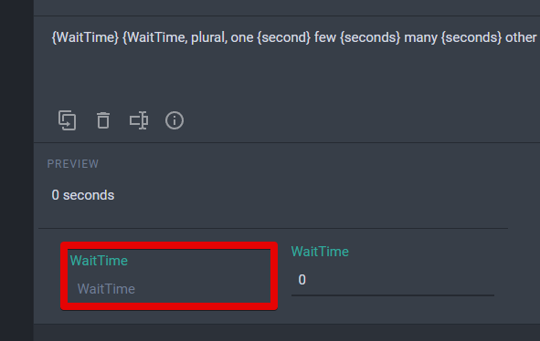
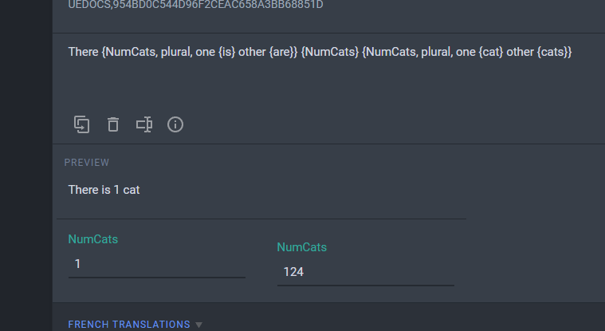

# Crowdin Feedback for Unreal PO Format

## Unreal PO Spec

*See [Unreal PO Format Spec](README.md)*

Links:
1. Unreal text localization and formatting: https://docs.unrealengine.com/4.27/en-US/ProductionPipelines/Localization/Formatting/
2. Gettext PO format description: https://www.gnu.org/software/gettext/manual/html_node/PO-Files.html

- [Crowdin Feedback for Unreal PO Format](#crowdin-feedback-for-unreal-po-format)
  - [Unreal PO Spec](#unreal-po-spec)
  - [Crowdin Feedback](#crowdin-feedback)
    - [Line-endings](#line-endings)
    - [UE→ICU conversion:](#ueicu-conversion)
    - [ICU→UE Conversion:](#icuue-conversion)

## Crowdin Feedback

### Line-endings

1. Windows line-endings aren't processed correctly.

    Results in `\r` in multiline strings which get in the way and provoke errors (e.g., if someone accidentally puts a space after it and it becomes `\r \n`, then it's not a line ending but two separate symbols and Unreal treats `\r` as text and displays it in the game as is).

### UE→ICU conversion:

2. Missing spaces before the expressiosn after conversion.

    How it look in PO vs. how it looks on Crowdin vs. how it should be:

    `{WaitTime} {WaitTime}|plural(one=second,other=seconds)`

    `{WaitTime}{WaitTime, plural, one {second} other {seconds}}`

    `{WaitTime} {WaitTime, plural, one {second} other {seconds}}`

3. Unnecessary outer quotes are left in after conversion.

    These quotes are needed in Unreal syntax but are not needed in ICU syntax since it's using curly bracers.

    How it look in PO vs. how it looks on Crowdin vs. how it should be:

    `{WaitTime} {WaitTime}|plural(one=\"{test} second\",other=\"{test} seconds\")`

    `{WaitTime}{WaitTime, plural, one {"{test} second"} other {"{test} seconds"}}`

    `{WaitTime}{WaitTime, plural, one {{test} second} other {{test} seconds}}`

4. Missing internal quotes that are part of the string itself.

    This example also has unnecessary outer quotes, see bug #3 above.

    How it look in PO vs. how it looks on Crowdin vs. how it should be: 
    
    `{WaitTime}|plural(one=\"{WaitTime} \\\"second\\\" ago\",other=\"{WaitTime} \\\"seconds\\\" ago\")`

    `{WaitTime, plural, one {"{WaitTime} second ago"} other {"{WaitTime} seconds ago"}}`
    
    `{WaitTime, plural, one {{WaitTime} "second" ago} other {{WaitTime} "seconds" ago}}`

5. The conversion is also applied to the comments.

    It should only be applied to the strings. As an example, I had an original string in UE syntax in a comment, and got something completely broken on Crowdin:

    

6. Extra variables on the ICU preview/helper pane.

    There's an extra variable on the ICU preview/helper pane that shouldn't be there. It doesn't affect anything, as the ICu expression itself is controlled by the second instance of the same variable.

    There should be just one variable on the ICU preview/helper pane no matter how many times the variable appers in the string: it's still the same variable.
    
    

    

7. Ordinals, genders and Hangul postpositions aren't supported.

    https://docs.unrealengine.com/4.27/en-US/ProductionPipelines/Localization/Formatting/#pluralforms

    `You came {Place}{Place}|ordinal(one=st,two=nd,few=rd,other=th)!` → https://support.crowdin.com/icu-message-syntax/#select-ordinal (only keywords are supported by default)

    `{variable_name}|gender(Le guerrier est fort,La guerrière est forte)` → https://support.crowdin.com/icu-message-syntax/#select (By default, Unreal has masculine, feminine, and neuter genders and it's the order of the forms in the expression.)

    `{variable_name}|hpp(은,는)` → ... (I guess we could convert that into a `select` expression?)

### ICU→UE Conversion:

8. Outer quotes are escaped twice.

    How it looks on Crowdin vs. how it looks in the exported PO vs. how it should be:

    `{WaitTime} {WaitTime, plural, one {second} other {seconds}}`

    `{WaitTime} {WaitTime}|plural(one=\\\"second\\\", other=\\\"seconds\\\")` - wrong

    `{WaitTime} {WaitTime}|plural(one=\"second\", other=\"seconds\")` - okay

    `{WaitTime} {WaitTime}|plural(one=second, other=seconds)` - okay

    There are two ways to go about quoting: minimal and quote all. It seems nicer to go the minimal way and only quote plural forms that require to be quoted (contain commas), and leave the simpler cases unquoted. But quoting all plural forms on export would work, too.

    This could be an option in parser settings.

9. Internal quotes in quoted strings aren't escaped enough

    `{WaitTime, plural, one {{WaitTime} "second" ago} other {{WaitTime} "seconds" ago}}`

    `{WaitTime}|plural(one=\\\"{WaitTime} \"second\" ago\\\", other=\\\"{WaitTime} \"seconds\" ago\\\")` - wrong

    `{WaitTime}|plural(one=\"{WaitTime} \\\"second\\\" ago\", other=\"{WaitTime} \\\"seconds\\\" ago\")` - okay

    `{WaitTime}|plural(one={WaitTime} \"second\" ago, other={WaitTime} \"seconds\" ago)` - okay

10. `#` inside a plural form should be converted into the variable name

    `{WaitTime, plural, one {# sec} other {# sec}}`

    `{WaitTime}|plural(one=\"# sec\",other=\"# sec\")` - wrong

    `{WaitTime}|plural(one=\"{WaitTime} sec\",other=\"{WaitTime} sec\")` - okay

    `{WaitTime}|plural(one={WaitTime} sec,other={WaitTime} sec)` - okay

11. `=N` plural forms should be removed or at least be flagged as QA issues

    It seems that now Corwidn just doesn't let you add `=N` options, throwing an "ICU structure is not the same" error.